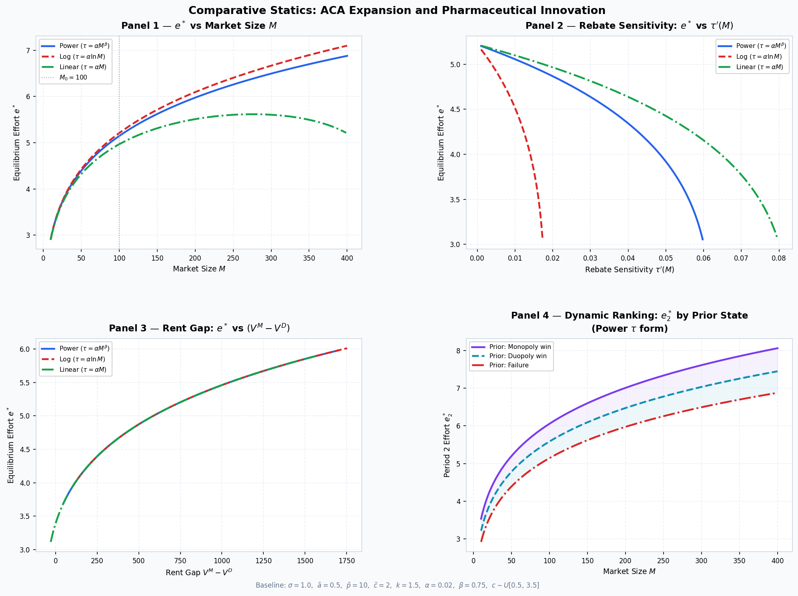

# Recap

## The Model

- Built a model that explains potentially high profits if PDL status granted
- If both firms pass P&T stage price competition leaves a small margin
- If rebates are large then innovation falls in general despite market size increases

**Missing argument:**

- Why does innovation increase for firms on the PDL and decrease for firms that just miss out?

## Next Steps from last time

| Item | Progress |
| --------- | -- | 
| Find data for $\tau(M)$ increasing with $M$ | ✅ |
| Texas PDL representativenesss | ✅ |
| Implement RQ3 into theoretical model | ❌ |
| Policy implications | ✅ |
| Begin drafting thesis | ❌ |

# Robustness Checks

## Is $\tau'(M) > 0$ ?

```{r}

library(here)

source(here("exploration/rebate_exploration.r"))

modelsummary(m1)

```

## Is the Texas PDL representative of other state PDLs?

```{r}

source(here("exploration/pdl_overlap_analysis.r"))

overlap_table

```


# Theoretical Model

## Motivation

We want a model that explains two empirical facts:

1. Medicaid expansion increases state purchasing power and rebates
2. Firms that secure PDL placement tend to innovate more in subsequent periods.

The model therefore needs to capture both:

- The static effect of procurement on current innovation incentives
- The dynamic effect of current rents on future R\&D effort

## Stage 1 — Innovation Effort

Firms choose R\&D effort $e_i$.

Clinical quality is stochastic:

$$
a_i = \ln(e_i) + \varepsilon_i,
\qquad
\varepsilon_i \sim N(0,\sigma^2)
$$

Effort is costly and convex:

$$
C(e_i) = \frac{1}{2} k e_i^2
$$

Interpretation:

- Higher effort raises expected clinical quality
- Innovation remains uncertain
- Firms trade off expected returns against convex effort costs

## Stage 2 — The P\&T Stage

A drug qualifies for procurement consideration if it exceeds threshold $\bar a$.

Approval rule:

$$
a_i \ge \bar a
$$

Probability of passing:

$$
Q(e_i) = \Pr(a_i \ge \bar a)
= 1 - \Phi\left(\frac{\bar a - \ln e_i}{\sigma}\right)
$$

Effort increases the probability of reaching the pricing stage.

## Stage 3 — The Pricing Subgame

For firm $i$, there are three possible outcomes:

| State | Condition | Value |
|-------|----------|-------|
| Monopoly | $i$ passes, $j$ fails | $V^M$ |
| Duopoly | both pass | $V^D$ |
| Failure | $i$ fails | $0$ |

Effort $e_i$ affects the probability of landing in:

- A high-rent monopoly state
- A lower-rent duopoly state
- No market access state

## State A — Monopoly

If only firm $i$ passes:

- firm $i$ is the sole listed supplier
- the state imposes a rebate wedge $\tau(M)$
- total Medicaid market size is $M$

With inelastic demand, monopoly value is:

$$
V^M = M(\bar p - c - \tau(M))
$$

Medicaid expansion affects monopoly rents through two channels:

- $M \uparrow$ increases volume
- $\tau(M) \uparrow$ increases rebates

The effect on $V^M$ is ambiguous

## State B — Duopoly (Procurement Auction)

If both firms pass:

- Firms submit sealed bids $b_i$
- The lowest bid wins PDL status
- Costs are private information

Costs satisfy:

$$
c_i \sim F(c)
\qquad \text{on } [\underline c, \bar c]
$$

Profit for firm $i$ is:

$$
\pi_i =
\begin{cases}
M(b_i - c_i - \tau(M)) & \text{if } b_i \le b_j \\
0 & \text{otherwise}
\end{cases}
$$

## Auction Equilibrium

Under a symmetric Bayesian Nash equilibrium, the bidding strategy is:

$$
b(c) = c + \tau(M)
+ \frac{\int_c^{\bar c}(1-F(u))\,du}{1-F(c)}
$$

Expected duopoly value is therefore:

$$
V^D = M \int_c^{\bar c}(1-F(u))\,du
$$

- Competition drives bids down
- The winner earns only a limited informational rent
- Duopoly profits are much lower than monopoly profits

## The Firm's Maximisation Problem

Firm $i$ chooses effort to maximise expected profits:

$$
\max_{e_i} \Psi_i =
Q(e_i)[1-Q(e_j)]V^M
+
Q(e_i)Q(e_j)V^D
-
\frac{1}{2} k e_i^2
$$

- Effort matters because it raises the chance of reaching a profitable state
- Monopoly is the high-value state
- Duopoly is profitable, but much less so

## Optimal Effort

First-order condition:

$$
Q'(e_i)\left[(1-Q(e_j))V^M + Q(e_j)V^D\right]
=
k e_i
$$

In a symmetric equilibrium we have:

$$
e^* = e_i = e_j
$$

This defines optimal effort $e^*$

## Strategic Substitutes

The best response slope satisfies:

$$
\frac{d BR_i(e_j)}{d e_j}
=
-
\frac{\Psi_{ij}}{\Psi_{ii}}
$$

The cross-partial is:

$$
\Psi_{ij}
=
Q'(e_i)Q'(e_j)(V^D - V^M)
$$

Since:

$$
V^M > V^D
\qquad \text{and} \qquad
Q'(e) > 0
$$

it follows that:

$$
\Psi_{ij} < 0
$$

Hence best responses are downward sloping and R\&D efforts are **strategic substitutes**.

## The opposing monopoly effects

The Medicaid expansion increased market size $M$, but it also strengthened rebates.

Monopoly value is:

$$
V^M = M(\bar p - c - \tau(M))
$$

Hence:

$$
\frac{dV^M}{dM}
=
(\bar p - c - \tau(M))
-
M\tau'(M)
$$

This gives two opposing effects:

- **Volume effect**: larger market raises returns
- **Monopsony effect**: larger market raises rebate pressure

If rebate growth is sufficiently steep, the monopsony effect dominates and monopoly rents fall.

## Explaining the Static Puzzle

Expansion changes incentives via:

$$
V^M = M(\bar p - c - \tau(M)),
\qquad
V^D = M \int_c^{\bar c}(1-F(u))\,du
$$

If the expected continuation payoff falls with market size,

$$
\frac{d}{dM}
\left[
(1-Q)V^M + QV^D
\right]
< 0
$$

then:

$$
\frac{de^*}{dM} < 0
$$

So innovation can fall even though the market becomes larger.

## Why the Static Model Is Not Enough

In the data, firms that secure PDL placement tend to innovate more in later periods.

This means the procurement game should not be treated as one-shot.

Instead:

- Current procurement outcomes affect future firm states
- Those states affect future R\&D incentives
- The model should be dynamic

## Dynamic Extension - State-Dependent Innovation

Following the intuition suggested in @ericson1995markov, current outcomes can be used as state variables for future investment.

Period 1 outcomes generate three Period 2 states:

| Period 1 outcome | Period 2 implication |
|---|---|
| Failure | no rents, weakest future position |
| Duopoly | some rents, intermediate future position |
| Monopoly | highest rents, strongest future position |

In this model procurement outcomes affect future innovation incentives.

## Economic Mechanism

A natural mechanism is that PDL success affects future R\&D through:

- Internal cash flows
- Accumulated organisational capabilities
- Accumulated regulatory capabilities

If a firm secures higher rents today, it is in a stronger position to fund and pursue innovation tomorrow.

Success today can result in greater innovation tomorrow.

## The Dynamic Extension

Period 1 payoffs:

$$
\pi_{i,1} \in \{V^M, V^D, 0\},
\qquad
V^M > V^D > 0
$$

Let the Period 2 effort cost depend on the Period 1 payoff:

$$
C_2(e_{i,2};\pi_{i,1})
=
\frac{1}{2}k(\pi_{i,1}) e_{i,2}^2,
\qquad
k'(\pi_{i,1}) < 0
$$

Hence:

$$
k(V^M) < k(V^D) < k(0)
$$

Higher prior profits lower the effective marginal cost of future R\&D.

## Period 2 Effort

In Period 2, the firm solves:

$$
Q'(e_{i,2})
\left[
(1-Q(e_{j,2}))V^M + Q(e_{j,2})V^D
\right]
=
k_i e_{i,2}
$$

where:

$$
k_i = k(\pi_{i,1})
$$

Since optimal effort is decreasing in the cost parameter $k_i$, it follows that:

$$
e_2^*(V^M) > e_2^*(V^D) > e_2^*(0)
$$

This matches the empirical finding that firms securing PDL placement innovate more in subsequent periods!

## Implications

If the Medicaid expansion compresses monopoly rents $V^M$, then it does not only reduce current innovation incentives.

It may also reduce:

- Internal funds available for later R\&D
- The continuation value of PDL success
- The firm's future innovative capacity

The decline in innovation may be multi-period rather than purely contemporaneous

## Comparative Statics



# Policy Implications

## The trade-off

The model highlights a trade-off:

- States want to reduce Medicaid spending with lower net drug prices
- Firms need sufficiently high expected returns to justify R\&D spending

Deeper rebates indicate lower current prices but this would weaken innovation incentives

The key issue is whether the procurement system provides firms with sufficient rewards to keep investing in new drugs

## Sustaining innovation

There are two broad ways to maintain innovation incentives:

1. Lower the "harm" inflicted to firms through the rebate schedule
2. Lower the cost of R\&D through subsidies or lower clinical development costs

# Bibliography

## References

::: {#refs}
:::