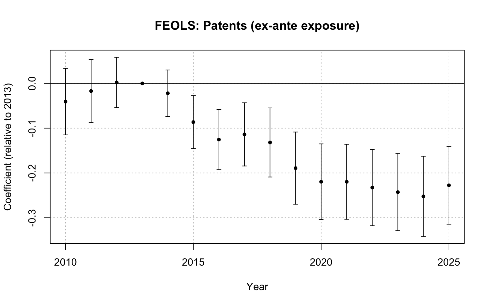
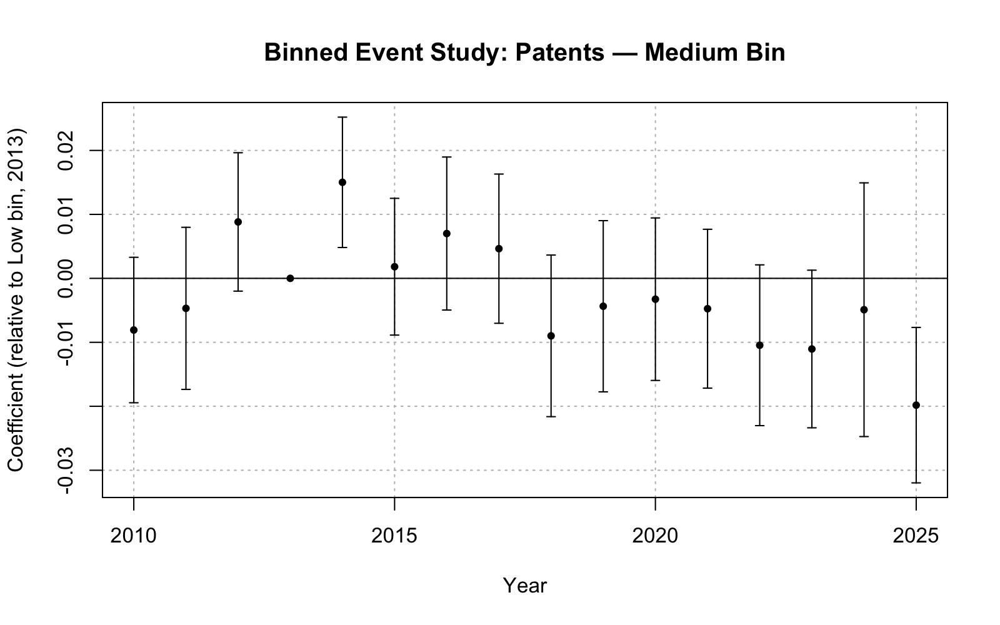
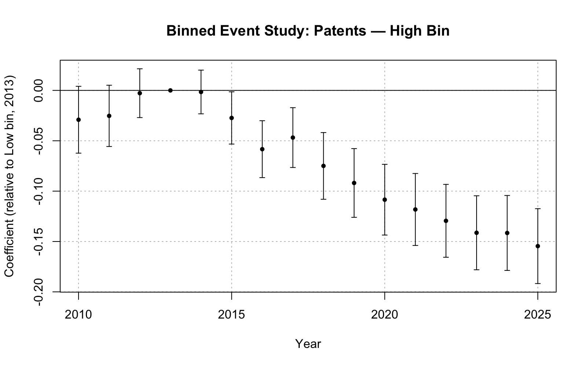
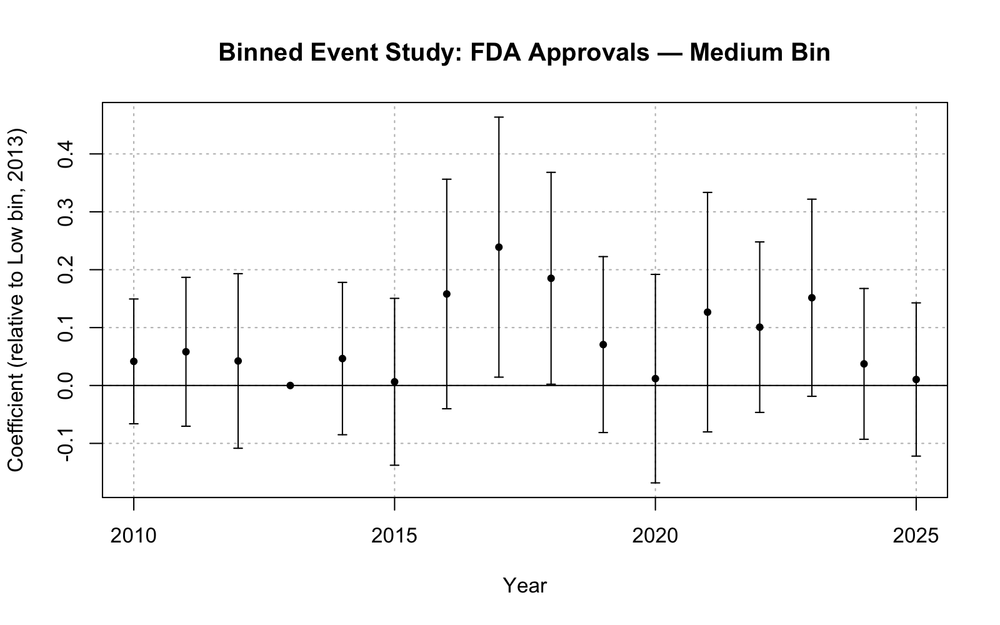
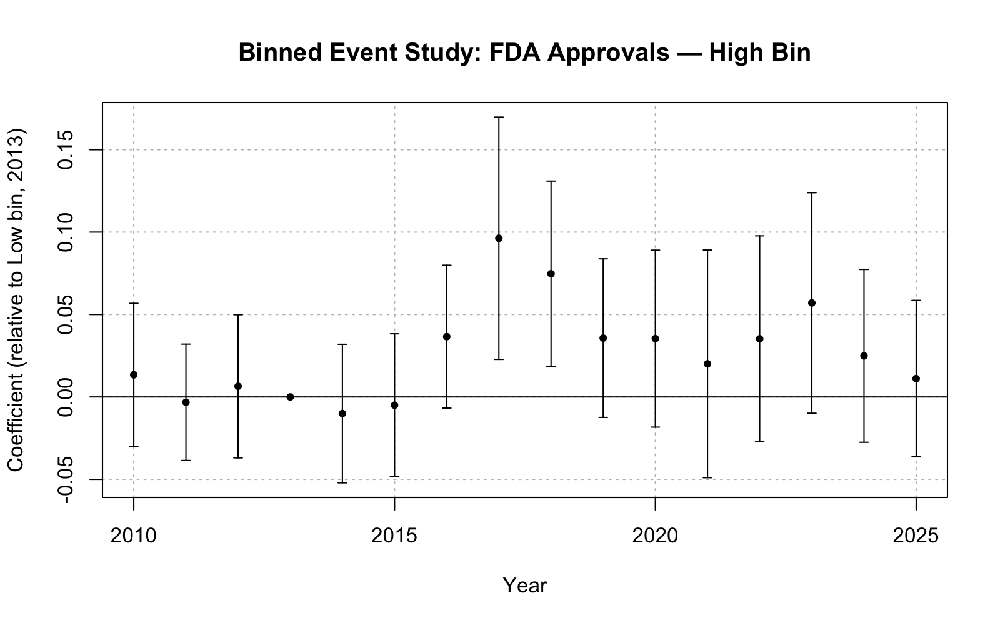
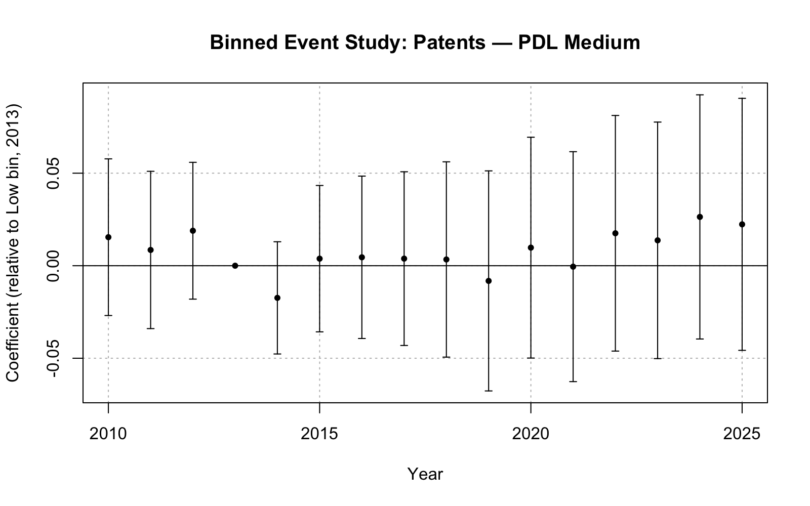
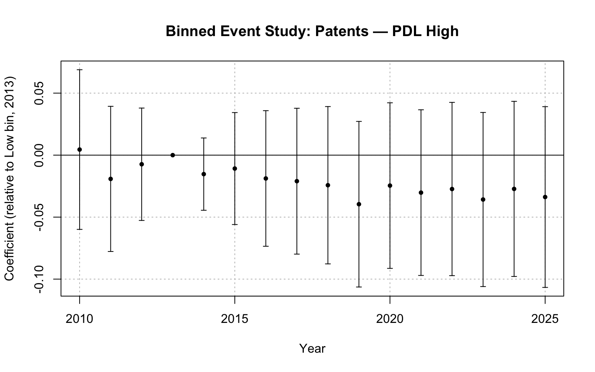
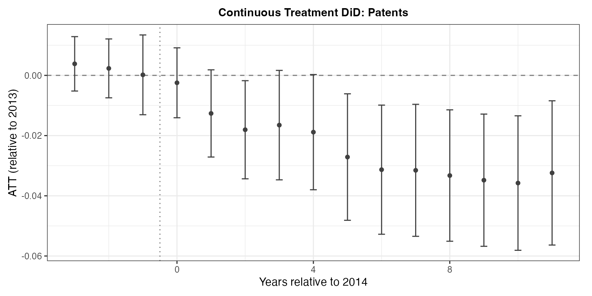
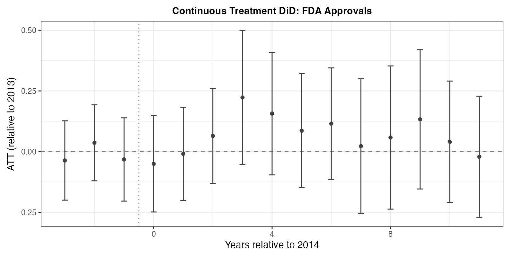

# Overview

## Possible Structuring of Results

| Section | Specification |
|---|---|
| Empirical Results | FEOLS + ex-ante Medicaid share |
| Robustness | FE Poisson |
| Robustness | Ex-post Medicaid share |
| Robustness | Binned treatment (RQ1, RQ2) |
| Robustness | Continuous DiD (RQ1) |

## Parallel trends

- Event study plots will be displayed in empirical results
- Pre-expansion coefficients are visible in this section
- Where should formal parallel discussion go?

# Binned Treatment

## Motivation

- FEOLS specification imposes a linear relationship between pre-expansion Medicaid exposure and the post-expansion innovation response.

$$
Y_{f,c,t} = \alpha_{f,c} + \delta_t + \sum_{k \neq 2013} \beta_k \left[ \mathbf{1}\{t=k\} \times \text{MedicaidShare}_c \right] + \varepsilon_{f,c,t}
$$

- Assumes innovation response scales proportionally with MMS 
- If the true response is nonlinear then $\hat\beta_k$ is misspecified
- Binning is a functional-form robustness check — not a TWFE robustness check

## Tercile assignment

| Class | Medicaid Share | Tercile |
|---|---|---|
| N | 0.363 | High |
| C | 0.215 | High |
| J | 0.120 | High |
| D | 0.099 | High |
| R | 0.085 | Medium |
| A | 0.068 | Medium |
| M | 0.015 | Medium |
| H | 0.012 | Medium |
| L | 0.006 | Medium |
| G | 0.006 | Low |
| S | 0.005 | Low |
| B | 0.005 | Low |
| V | 0.000 | Low |
| P | 0.000 | Low |

## Implementation

- Replace continuous $\text{Medicaid_Share}_c$ with tercile dummies
- Low, Medium,High

- Use Low as reference group i.e. omitted from regression

- Same procedure for $\text{PDL_Exposure}_{f,c}$
- Use both Medicaid and PDL bins for RQ2 - four event studies !

## Patents — RQ1 (Medium bin)

## Patents — RQ1 (High bin)

- Innovation response for High bin is around 7 times larger than Medium
- Would expect doubling in response to treatment intensity if linear
- Results therefore suggest that innovation response is strongly non-linear
- Effect largely concentrated in the highest-exposure classes

## FDA Approvals — RQ1 (Medium bin)

## FDA Approvals — RQ1 (High bin)

- Both bins largely insignificant — consistent with the baseline results

## RQ2 — PDL bins (Patents, Medium)

## RQ2 — PDL bins (Patents, High)

## Inconsistent PDL results

- Baseline FEOLS shows a sustained significant negative PDL effect
- Both Medium and High PDL bins are insignificant across all periods
- PDL exposure has mean ≈ 0 and SD = 0.02 — mostly zeros
- With tercile binning: Low = all zeros, Medium = all zeros, High = mostly zeros with a small number of positive observations
- Medium bin compares with Low group — uninformative since zero to zero comparison
- High bin contains the positive observations but diluted by many near-zeros also assigned to that tercile
- Is it worth including a binned specification for RQ2?

**The continuous estimate is the appropriate spec given the PDL DGP so bins are uninformative here. The PDL effect is concentrated among the small share of observations with non-zero exposure**

# Continuous DiD

## Callaway, Goodman-Bacon & Sant'Anna (2024)

- Non parametric method
- Relaxes the linearity in treatment intensity assumption more formally
- Use bottom tercile as baseline group
- Runtime ~30 mins - probably not feasible for RQ2
- Probably not applicable to a DDD in RQ3
- Could consider collapsing heavily to make it work for RQ2

## Patents

- Pre-period insignificant
- Sustained significant negative response from 2019 onwards

## FDA Approvals

- Insignificant throughout — consistent with RQ1

# Pitfalls

## Potential issues

| Issue | Implication | Potential response |
|---|---|---|
| 27% patent-firm match rate | Missing data could be driving the result | Show match rate by year; show ATC distribution for matched and unmatched patents |
| Generic ANDAs in FDA approvals | Generics do not count towards novel innovation and could mask the true approvals response | Remove ANDAs then re-estimate using NDAs and BLAs only |
| Ex-ante vs ex-post exposure | Post-expansion Medicaid share could be endogenous | Use ex-post as a robustness check just to see if results align |
| RQ3 parallel trends | Cannot formally test pre-trends at class level — DDD event study is computationally difficult | RQ1 pre-trends hold in aggregate; class-level Medicaid share is predetermined by drug chemistry |